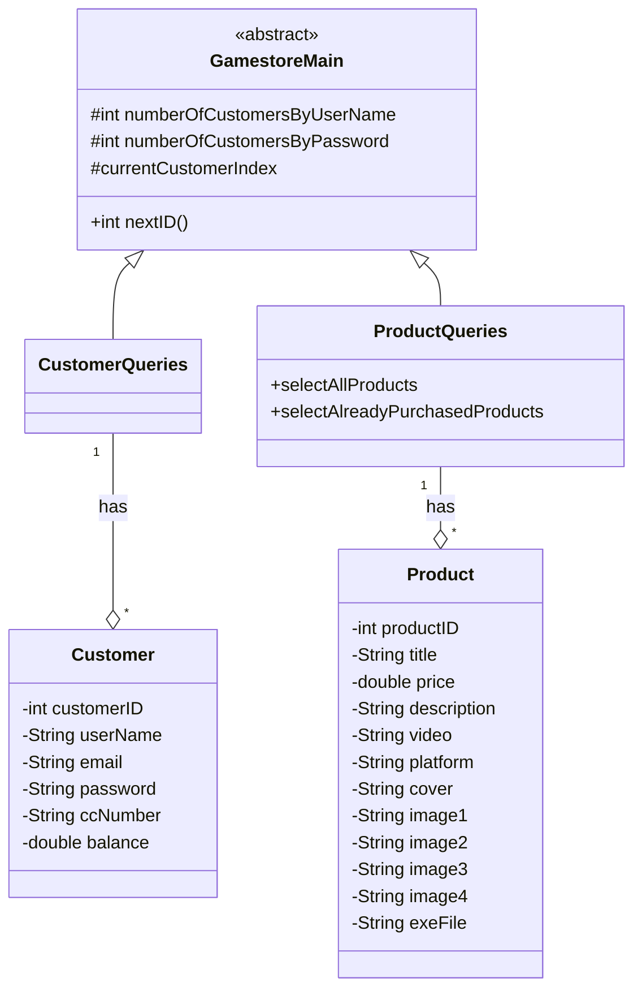
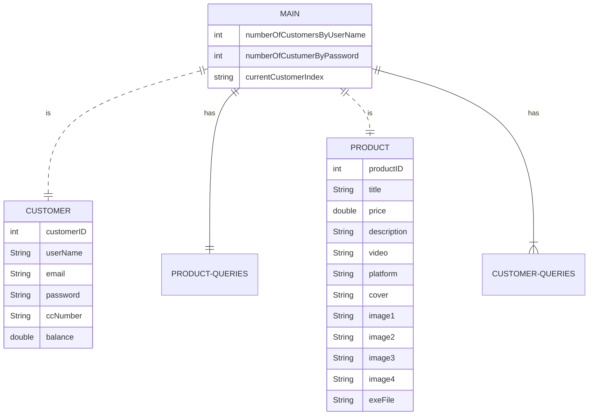

# UnilaGameStore
Dibuat untuk memenuhi tugas final project mata kuliah Pemrograman Berorientasi Objek, 20/21 Ganjil, S1 Ilmu Komputer, Universitas Lampung.
ANGGOTA:
1917051044 - Olivia Desti Riana
1917051028 - Zahara Liza Mulyani
1917051004 - Salsabilla Julia Farhana
PEMBAGIAN TUGAS:
1. Olivia Desti Riana / 1917051044 
(-Membuat Codingan Program main, fxml dan cintroller, MYSQLConnection Database, Interface,  MengUpload file  build
-impl.xml ,  genfiles.properties, jfx-impl.xml , project.properties, project.xml)

2. Zahara Liza Mulyani / 1917051028 
(-Membuat isi Redme.md -membuat sql, code program 
SistemGudang.java,SistemGudangDataModel.java 
-Mengapload file project.xml, Akun.java, CorporateHolder.java, IndividualHolder.java,  Main.java , SistemGudang.java, SistemGudangDataModel.java, SistemGudangForm.fxml, SistemGudangFormController.java)

3. Salsabilla Julia Farhana / 1917051004 
(-Membuat isi Redme.md, code programCorporateHolder.java, IndividualHolder.java, -design class diagram untuk java FX - membuat Database, 
-Mengapload file gitignore , SisGudang.sqlite,  build.xml,   manifest.mf, master)

# CLASS DIAGRAM

# ER DIAGRAM

# REFERENSI
https://www.codingparks.com/how-to-create-book-shop-management-system-in-java-javafx/
https://docs.oracle.com/javafx/2/api/javafx/scene/doc-files/cssref.html
https://stackoverflow.com/questions/7880410/best-reference-for-javafx-css-properties-selectors
https://www.posciety.com/cara-menampilkan-gambar-di-java-netbeans-ide/
https://examples.javacodegeeks.com/desktop-java/javafx/scene/javafx-scene-builder-tutorial/
