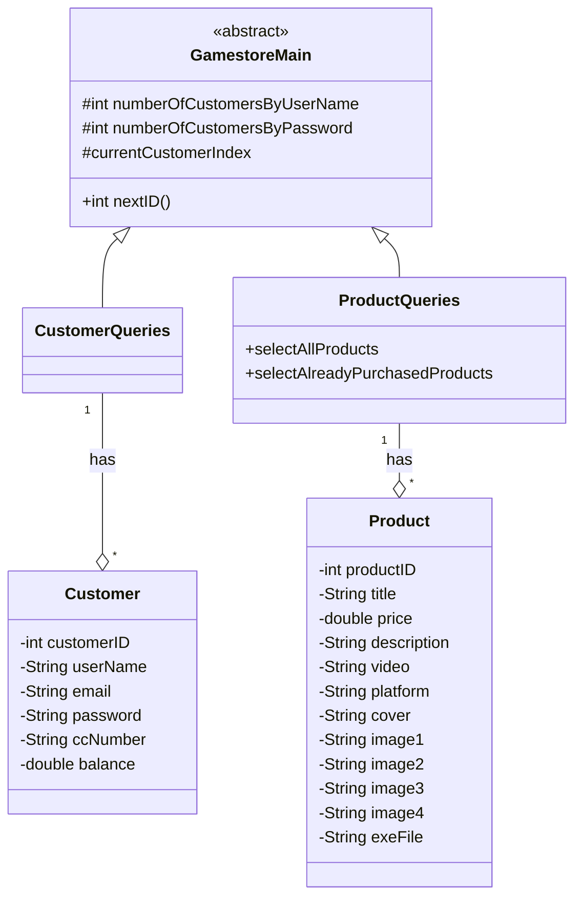
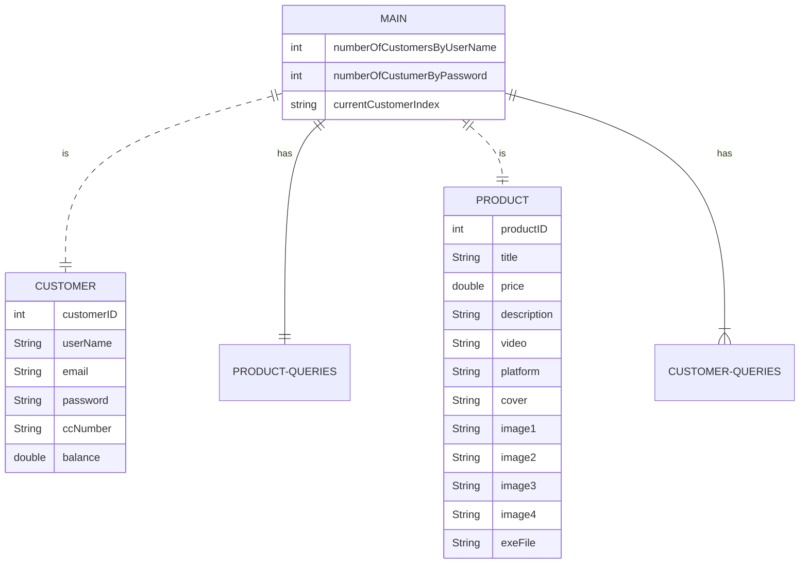

# UnilaGameStore
Dibuat untuk memenuhi tugas final project mata kuliah Pemrograman Berorientasi Objek, 20/21 Ganjil, S1 Ilmu Komputer, Universitas Lampung.
ANGGOTA:
1917051044 - Olivia Desti Riana
1917051028 - Zahara Liza Mulyani
1917051004 - Salsabilla Julia Farhana
PEMBAGIAN TUGAS:
1. Olivia Desti Riana / 1917051044 
(-Membuat isi Redme.md,Membuat Codingan Program main, fxml, cart.fxml, checkout.fxml, library.fxml,product.java, imagetextcell.java MYSQLConnection Database, Interface, MengUpload folder build, -Mengupload file manifest.mf)

2. Zahara Liza Mulyani / 1917051028 
(-Membuat isi Redme.md -membuat sql, kodingan accountcontroller.java, cartcontroller.java, logincontroller.java, registercontroller.java , customer.java, productqueries.java -Mengapload folder src, dist, -Mengupload file gamestore_fx_db.sql)

3. Salsabilla Julia Farhana / 1917051004 
(-Membuat isi Redme.md, kodingan checkoutcontroller.java, librarycontroller.java, login.fxml,register.fxml  -design class diagram untuk java FX - membuat Database, -Mengapload folder nbproject, screenshot, -Mengupload file build)

# CLASS DIAGRAM

# ER DIAGRAM

